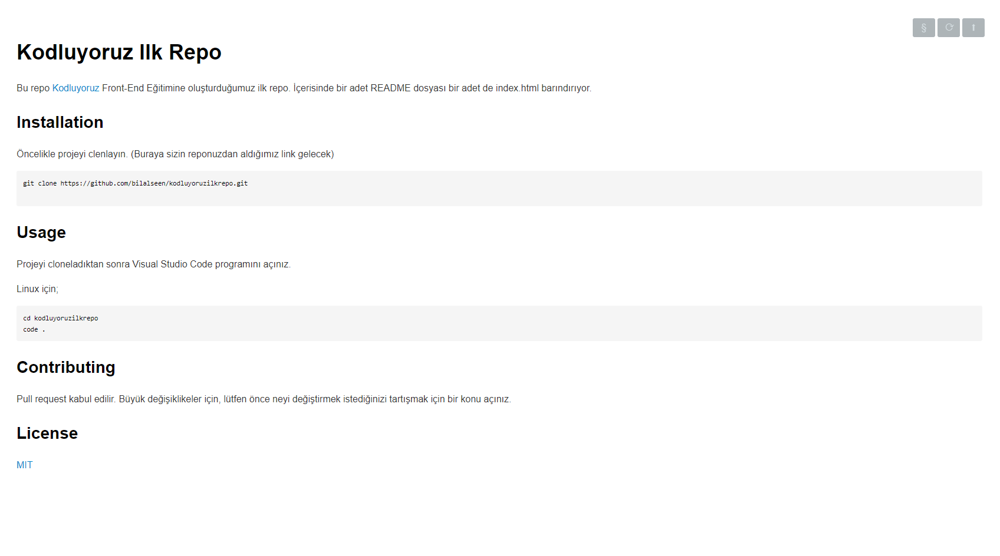

# Kodluyoruz Ilk Repo

Bu repo [Kodluyoruz](https://kodluyoruz.org/) Front-End Eğitimine oluşturduğumuz ilk repo. İçerisinde bir adet README dosyası bir adet de index.html barındırıyor.



## Installation

Öncelikle projeyi clenlayın. (Buraya sizin reponuzdan aldığımız link gelecek)

```
git clone https://github.com/bilalseen/kodluyoruzilkrepo.git

```

## Usage

Projeyi cloneladıktan sonra Visual Studio Code programını açınız.

Linux için;

```
cd kodluyoruzilkrepo
code .
```

## Contributing

Pull request kabul edilir. Büyük değişiklikeler için, lütfen önce neyi değiştirmek istediğinizi tartışmak için bir konu açınız.

## License

[MIT](https://choosealicense.com/licenses/mit/)